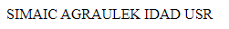
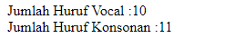
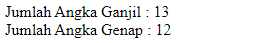
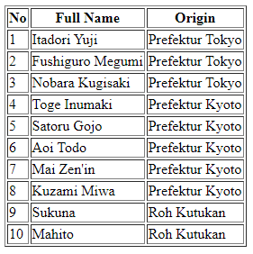

# **Basic Programming**

### **Notes :**
* Pilih bahasa pemrograman yang kalian kuasai.
* Kerjakan soal didalam folder `basic-programming`.
* Kerjakan soal yang menurut anda paling mudah.
---


**1. Asteriks**
---
Buatlah output program seperti dibawah ini :
```
*
**
***
****
*****
```

**2. String Reverse**
---
Contoh `input` Jika menggunakan PHP :
```PHP
$input = "RSU DADI KELUARGA CIAMIS";
```
Contoh `input` Jika menggunakan Javascript :
```javascript
let input = "RSU DADI KELUARGA CIAMIS";
```
Output yang diharapkan dapat seperti gambar berikut :



**3. Hitung Jumlah Huruf Vocal dan Konsonal**
---
Contoh `input` Jika menggunakan PHP :
```PHP
$string = "RSU DADI KELUARGA CIAMIS";
```
Contoh `input` Jika menggunakan Javascript :
```javascript
let string = "RSU DADI KELUARGA CIAMIS";
```
Hitunglah setiap huruf jumlah huruf vocal dan konsonal pada kalimat diatas.
Output yang diharapkan dapat seperti gambar berikut :



***Hint** : Spasi tidak dihitung.* 

**4. Hitung Jumlah Angka Ganjil dan Anggka Genap**
---
Contoh `input` Jika menggunakan PHP :
```PHP
$min = 1;
$max = 25;
```
Contoh `input` Jika menggunakan Javascript :
```javascript
let min = 1;
let max = 25;
```
Hitung lah jumlah setiap huruf ganjil dan genap diantaran 1 sampai dengan 25. Dengan output yang diharapkan sebagai berikut :



**5. Array Iteration**
---
Contoh `input` Jika menggunakan PHP :
```PHP
$array = [
	[1, 'Itadori Yuji', 'Prefektur Tokyo'],
	[2, 'Fushiguro Megumi', 'Prefektur Tokyo'],
	[3, 'Nobara Kugisaki', 'Prefektur Tokyo'],
	[4, 'Toge Inumaki', 'Prefektur Kyoto'],
	[5, 'Satoru Gojo', 'Prefektur Kyoto'],
	[6, 'Aoi Todo', 'Prefektur Kyoto'],
	[7, 'Mai Zen\'in', 'Prefektur Kyoto'],
	[8, 'Kuzami Miwa', 'Prefektur Kyoto'],
	[9, 'Sukuna', 'Roh Kutukan'],
	[10, 'Mahito', 'Roh Kutukan'],
];
```
Contoh `input` Jika menggunakan Javascript :
```javascript
let arr = [
	[1, 'Itadori Yuji', 'Prefektur Tokyo'],
	[2, 'Fushiguro Megumi', 'Prefektur Tokyo'],
	[3, 'Nobara Kugisaki', 'Prefektur Tokyo'],
	[4, 'Toge Inumaki', 'Prefektur Kyoto'],
	[5, 'Satoru Gojo', 'Prefektur Kyoto'],
	[6, 'Aoi Todo', 'Prefektur Kyoto'],
	[7, 'Mai Zen\'in', 'Prefektur Kyoto'],
	[8, 'Kuzami Miwa', 'Prefektur Kyoto  '],
	[9, 'Sukuna', 'Roh Kutukan'],
	[10, 'Mahito', 'Roh Kutukan'],
];
```
Lakukan iterasi terhadap array untuk disajikan kedalam bentuk tabel seperti berikut ini :



### **Git Rule :**
* Sebelum melakukan push, buatlah `branch` baru dengan nama kalian.
* Commit dengan message `"Tes telah selesai"`.
* Push ke branch masing-masing.
* Tidak diperkenankan untuk push ke branch `master`.
* Buatlah pull request.